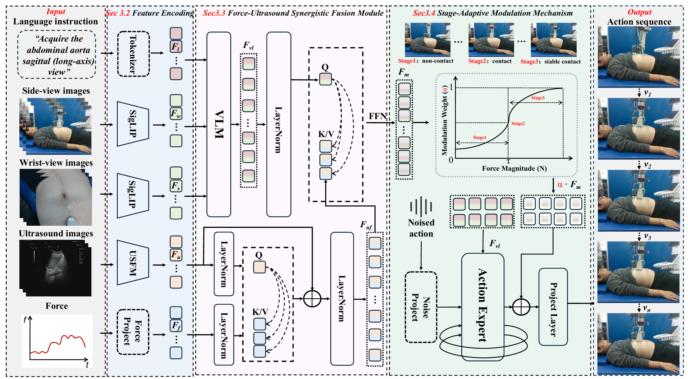

# ForceU-VLA: A Force-Aware Vision–Language–Action Model for Embodied Ultrasound Scanning

**Accepted to ACM MM 2026**

---

## Overview

**ForceU-VLA** is a **force-aware Vision–Language–Action (VLA)** model for **autonomous embodied ultrasound scanning**. To the best of our knowledge, it is the first to introduce **force feedback** into the VLA modeling framework for ultrasound scanning, jointly leveraging force signals and real-time ultrasound image feedback throughout the scanning process to enable accurate, stable, and high-quality probe–tissue interaction.

Unlike prior methods that treat force as an auxiliary control signal and adopt fixed multimodal fusion, ForceU-VLA elevates force to a **core modeling component** through two key designs:

- a **Force–Ultrasound Synergistic Fusion Module (FUSFM)** that tightly couples ultrasound and force modalities via cross-modal attention to provide stable and reliable guidance for probe motion;
- a **Stage-Adaptive Modulation Mechanism (SAMM)** that adaptively adjusts multimodal fusion strength across scanning stages (non-contact → contact → stable contact).

To support this task, we further construct **ForceU-VLA-Data**, a real-world, force-aware embodied ultrasound dataset integrating visual, force, and action signals, covering two organs (liver and kidney) and five standard clinical scanning views, comprising **450 expert trajectories** and approximately **100,000 synchronized multimodal frames**.

---

## Framework

  

The framework consists of the following components:

- **(1) Multimodal Feature Encoding.** Language instructions are tokenized into $F_l$; wrist- and side-view RGB images are encoded by **SigLIP** into $F_w$ and $F_s$; ultrasound images are encoded by a universal **US foundation model (USFM)** into $F_u$; and 6-DoF force/torque signals are embedded by a linear **Force Projection** into $F_f$.

- **(2) Force–Ultrasound Synergistic Fusion Module (FUSFM).** A **VLM** fuses language and RGB features into a global semantic representation $F_{vl}$. Cross-modal attention then couples ultrasound (query) with force (key/value) into a force-modulated representation $F_{uf}$; subsequently $F_{vl}$ (query) attends to $F_{uf}$ (key/value), and a feed-forward block yields the unified fused feature $F_m$.

- **(3) Stage-Adaptive Modulation Mechanism (SAMM).** A learnable, force-driven weight $\alpha(F)$ — a sigmoid of the contact-force magnitude — smoothly modulates the fused features across the non-contact, contact, and stable-contact stages, so that the model relies on the most informative modalities at each stage.

- **(4) Action Expert and Policy Head.** The stage-modulated features condition a flow-matching **Action Expert** that denoises a noised action and, through a **Project Layer**, generates a continuous probe-manipulation **action sequence**.

---

## Demos

Autonomous ultrasound scanning performed by ForceU-VLA (closed-loop inference).

<table>
  <tr>
    <td align="center" width="50%">
      <video src="https://github.com/VMVLab/ForceU-VLA/raw/main/7483e16a3d16eed92f9af48bb85ff857.mp4" controls muted width="100%"></video>
       
      <b>Example 1</b> · <a href="https://github.com/VMVLab/ForceU-VLA/raw/main/7483e16a3d16eed92f9af48bb85ff857.mp4">watch / download</a>
    </td>
    <td align="center" width="50%">
      <video src="https://github.com/VMVLab/ForceU-VLA/raw/main/770c12d60388af59ac71d18ad61b85cb.mp4" controls muted width="100%"></video>
       
      <b>Example 2</b> · <a href="https://github.com/VMVLab/ForceU-VLA/raw/main/770c12d60388af59ac71d18ad61b85cb.mp4">watch / download</a>
    </td>
  </tr>
</table>

> The embedded players render on GitHub after the videos are pushed to the `main` branch.
